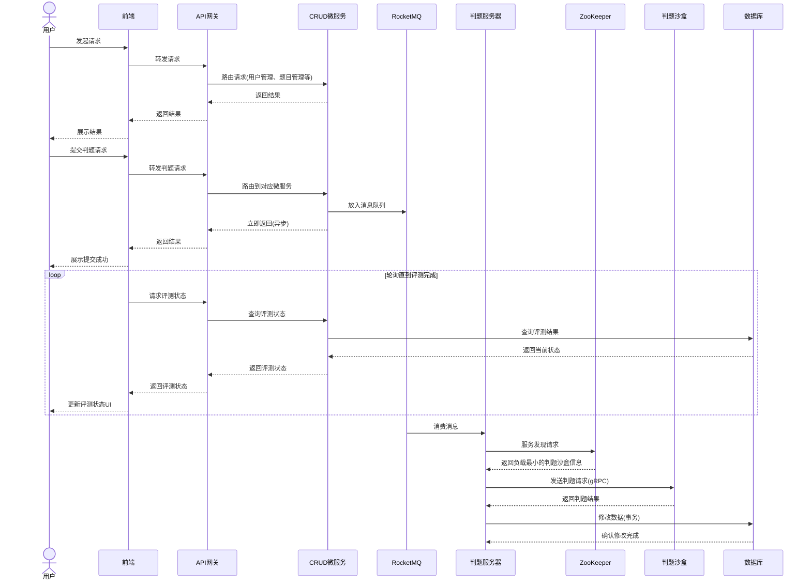

# CodeRushOJ

CodeRushOJ 是一个分布式在线评测系统，提供高效、可扩展的编程题目评测服务。系统采用微服务架构，支持高并发判题请求，为用户提供可靠的在线编程体验。

## 系统架构

CodeRushOJ 系统由以下几个主要部分组成：

1. 客户端层：Web 浏览器端应用

2. API 网关：统一入口，负责请求路由和负载均衡

3. 微服务层

	- 用户管理服务：处理用户注册、登录、权限管理等

	- 题目管理服务：负责题目的创建、修改、查询等

	- 提交管理服务：处理用户代码提交请求

	- 竞赛管理服务：处理竞赛相关的创建、参与、排名等

	- 判题服务：协调判题流程，与判题沙盒通信

4. 消息与服务发现层

	- RocketMQ：消息队列，用于异步处理判题请求

	- ZooKeeper：服务发现与注册，动态分配最优判题资源

	- 判题沙盒集群：通过 gRPC 通信，提供安全的代码执行环境

5. 数据层

	* MySQL：存储系统所有数据
	* Redis：缓存热点数据，提升系统响应速度

## 系统工作流程

### 常规请求流程

1. 用户通过前端发起请求
2. 请求经过 API 网关被路由到对应的 CRUD 微服务
3. 微服务处理请求并返回结果
4. 结果通过 API 网关返回给前端显示

### 判题请求流程

1. 用户提交代码进行评测
2. 请求通过 API 网关路由到提交管理服务
3. 提交管理服务将判题请求放入 RocketMQ 消息队列，并立即返回响应
4. 前端开始轮询判题状态
5. 判题服务从消息队列获取判题请求
6. 判题服务通过 ZooKeeper 查找负载最小的判题沙盒
7. 通过 gRPC 发送判题请求到判题沙盒
8. 沙盒执行代码并返回结果
9. 判题服务更新数据库中的判题状态和结果（事务操作）
10. 前端轮询获取到最终结果并更新 UI

## 技术栈

- 前端：Vue3/Vite
- 后端微服务：Spring Boot、Spring Cloud
- 判题服务器和判题沙盒：Go
- 数据库：MySQL、Redis
- 消息队列：RocketMQ
- 服务发现：ZooKeeper
- 通信：gRPC、REST API
- 容器化部署：Docker、Kubernetes

## 系统特点

- **高并发**：通过消息队列实现异步处理，支持高并发判题请求
- **可扩展**：微服务架构，各组件可独立扩展
- **高可用**：服务发现机制，动态路由请求到健康的服务节点
- **安全执行**：沙盒环境保证代码执行的安全性
- **负载均衡**：智能分配判题任务，保证资源高效利用